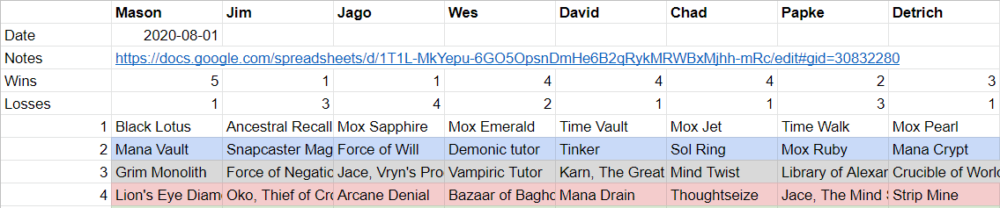
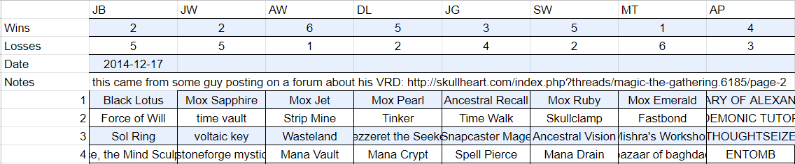

# MTG-rotisserie-draft-analytics
*This is an ongoing project.*

## Introduction

The purpose of this project is to perform preliminary exploratory data analysis on the gathered datasets representing tournaments of Magic: The Gathering Vintage Rotisserie Drafts (VRDs). 

A VRD is a casual limited format where rather than opening a random assortment of cards from a pool (pack), every single card legal in the (vintage) format is available and appears only once. The players take turns picking a card from all of the available sets, reversing the pick order every round. 

Not much documentation or instructional resources is available for learning the common pick patterns and best cards in the VRD format due to its casual nature. For the purpose of improving my win rate in the format and gaining a better understanding of the format (that I'm frankly pretty bad at) I decided to attempt to extract some information from prior games.

## Data collection and preprocessing
The gathered data is first preprocessed and collected in a Pandas DataFrame. We consider drafts with 8 players, 45-46 card picks and a regular ruleset. A subset of drafts includes the win/loss ratio or each respective subset of cards. Below is a quick representation of what the source data might look like.

## Feature selection

## Some of the acquired insights

## Resources
Datasets scavenged from: https://github.com/Hyphen-ated/VRDTools
Card data fetched from: https://scryfall.com/
