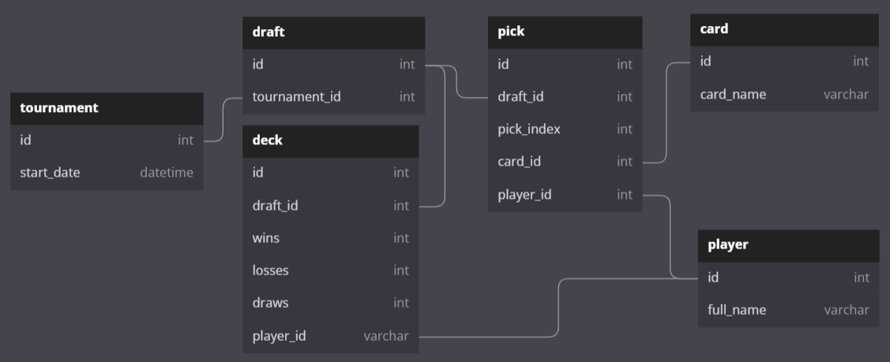

# MTG-rotisserie-draft-analytics

# Data collection and preprocessing
A subset of data from the available datasets including relative win/loss ratios of each deck/player, with 8 players present have been selected. Two of those files didn't include relative win/loss ratios but had it available in a separate source, these were compiled in extras.csv.

Based on the available information we build a database with the following schema:

# Sources
Datasets scavenged from: https://github.com/Hyphen-ated/VRDTools
Card data fetched from: https://scryfall.com/

